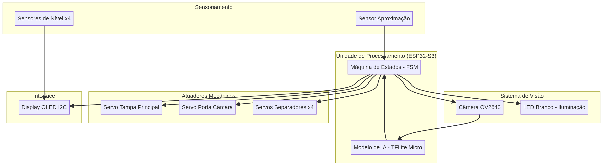
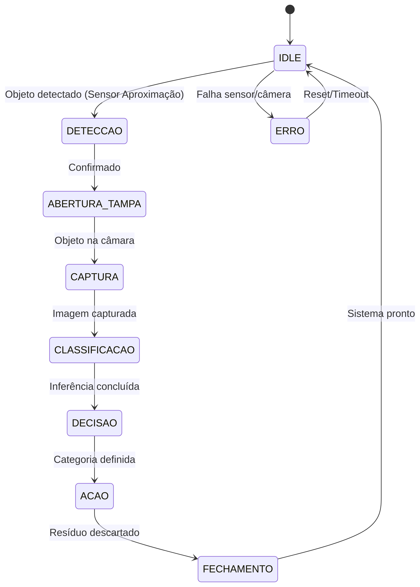

# EcoSort: Sistema de Separação Inteligente de Resíduos

O **EcoSort** é um sistema automatizado de separação inteligente de resíduos, desenvolvido como um MVP (Minimum Viable Product) educacional/tecnológico. Ele se destaca pela integração de **visão computacional embarcada**, **automação mecânica** e **eficiência ambiental**, funcionando de forma totalmente **offline** com processamento local no microcontrolador.

## 🎯 Objetivo

O principal objetivo do EcoSort é criar uma lixeira inteligente capaz de:

*   Detectar a aproximação de um objeto.
*   Capturar sua imagem.
*   Classificar o tipo de resíduo (Papel, Plástico, Metal, Vidro) utilizando um modelo de IA leve.
*   Direcionar automaticamente o resíduo para o compartimento correto.
*   Monitorar o nível de enchimento dos compartimentos.
*   Exibir o status do sistema em um display OLED.

## 🧠 Arquitetura Geral do Sistema

O sistema é composto por cinco blocos principais:

1.  **Unidade de Processamento:** Um ESP32-S3-WROOM que controla a Máquina de Estados Finita (FSM), a captura da câmera, a inferência de IA, os atuadores, os sensores e o display.
2.  **Sistema de Visão:** Câmera OV2640 (DVP) para captura de imagens e um LED branco para iluminação, garantindo a qualidade da imagem para a classificação.
3.  **Sistema Mecânico:** Seis servos SG90 responsáveis pela abertura da tampa principal, da porta da câmara de análise e das portas dos compartimentos de resíduos.
4.  **Sensoriamento:** Cinco sensores ultrassônicos HC-SR04, sendo um para detecção de aproximação de objetos e quatro para monitoramento do nível de enchimento dos compartimentos.
5.  **Interface:** Um display OLED de 0.96 polegadas (I2C) para exibir o status do sistema, a categoria detectada e mensagens de erro ou compartimento cheio.

## 🔄 Funcionamento (Fluxo Completo - FSM)

O EcoSort opera através de uma Máquina de Estados Finita (FSM) que gerencia o fluxo de trabalho:

1.  **IDLE:** Sistema aguardando a aproximação de um objeto.
2.  **DETECCAO:** Um objeto é detectado pelo sensor ultrassônico.
3.  **ABERTURA_TAMPA:** O servo da tampa principal se abre.
4.  **CAPTURA:** A porta da câmara de análise se fecha, o LED liga e a câmera captura a imagem do resíduo.
5.  **CLASSIFICACAO:** O modelo de IA embarcado no ESP32-S3 classifica o tipo de resíduo.
6.  **DECISAO:** Com base na classificação, o sistema decide qual compartimento abrir, verificando também o nível de enchimento.
7.  **ACAO:** O servo correspondente ao compartimento correto é acionado para descarte.
8.  **FECHAMENTO:** Todas as portas são fechadas e o sistema retorna ao estado IDLE.
9.  **ERRO:** Estado de tratamento de erros, com exibição de mensagem no display e tentativa de recuperação.

## ⚙️ Pinagem Oficial

A pinagem detalhada dos componentes no ESP32-S3 pode ser encontrada em `pinagem_EcoSort.md` e no esquema elétrico.

## ⚡ Esquema Elétrico

O esquema elétrico completo do projeto está disponível em `hardware/esquema_eletrico_EcoSort.png`.

## 💻 Firmware

O firmware é desenvolvido em C++ para a plataforma Arduino/ESP-IDF, com uma arquitetura modular para facilitar a manutenção e expansão. Os principais arquivos são:

*   `main.ino`: Ponto de entrada principal do programa.
*   `fsm.h`/`fsm.cpp`: Implementação da Máquina de Estados Finita.
*   `camera_module.h`/`camera_module.cpp`: Gerenciamento da câmera OV2640 e inferência de IA.
*   `servo_module.h`/`servo_module.cpp`: Controle dos servos SG90.
*   `ultrasonic_module.h`/`ultrasonic_module.cpp`: Leitura dos sensores ultrassônicos.
*   `display_module.h`/`display_module.cpp`: Controle do display OLED.
*   `led_module.h`/`led_module.cpp`: Controle do LED de iluminação.
*   `pins.h`: Definições de pinagem para todos os componentes.

Cada arquivo `.cpp` contém anotações detalhadas explicando o código.

## 🛠️ Instalação e Uso

Detalhes sobre como compilar e fazer upload do firmware, bem como a montagem do hardware, serão adicionados em futuras atualizações.

## 🤝 Contribuição

Contribuições são bem-vindas! Por favor, siga as diretrizes de contribuição (a serem definidas).

## 📄 Licença

Este projeto está licenciado sob a Licença MIT. Veja o arquivo `LICENSE` para mais detalhes.
